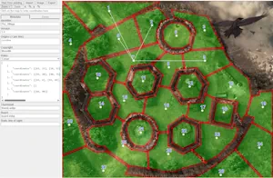
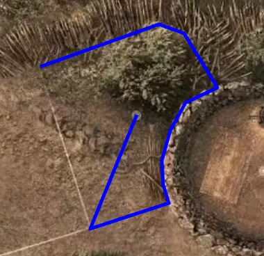
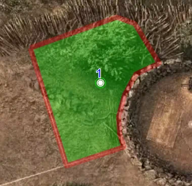
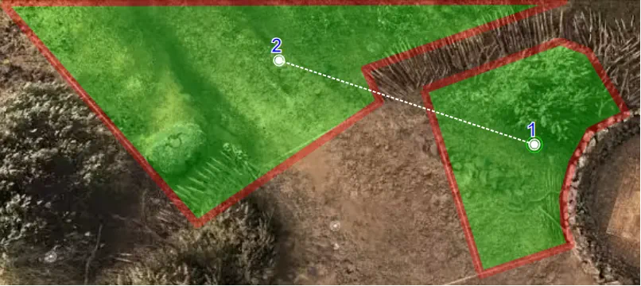

# Guide of the "maps" tool

The maps tool is an helper to do the hard stuff of adding a new board : drawing the zones and setting the line of sights (LOS).

Start by reading the [Readme](Readme.md) to understand the big picture and the technical details.

# Accessing the tool

The [maps tool](maps.html) is accessible in a browser.

# Disclamer

There is no automatic save system. Export very often your work to avoid data loss.

# Main commands 

## Edit an existing map

Use the "Start from existing" button, select the application and then the map to edit. For example `Conan` and `1` to edit the Pict village map of Conan.

## Import a previous backup

Use the Import button to select a local json that was previously exported.

If an image was provided separately, it will no be automatically restored, and you will have to select it again manually.

## Select the main image

Use the Image button to select the image on your computer to start from.

This button has to be used when you start from scratch or when you restore a local backup.

## Export

Use the Export button to get a json export of your work.

# Metadada tab

The main informations can be set in the tool, you can feel it or keep the default values and edit them later.

Take care of selecting the right "Rules" system.

See the technical information in the [Readme](Readme.md) to known more about the fields and the way to fill them

# Zones tab: The hearth of the tool

## Introduction the coordinates tool

On the nearly top of the tool, you will find buttons to zoom the map to be easily usable.

Just on the right of the zoom buttons, a display will show you the current coordinates of the mouse in the map.
Coordinates are two values [x, y] that are a percentage of the width and height of the maps. Valid coordinates are thus between 0 and 100. [0, 0] is the top left, and [100, 100] the bottom right.

Just under the zoom buttons, a field will display the coordinates selected.
1. Click once on the map, the coordinates of the click will appear in this field. A black point will be visible on the map.
2. Click a second time, you will see both coordinates comma-separated in the field + a line between those points on the map
3. Continue to click to delimit a zone

* Feel free at any moment to edit the coordinates field manually: fix a value (100 in stead of 99.87), remove a point, reorder...
* When manually editing this field, any syntax error will make the lines to disappear from the image: fixing it will restore the lines. A common mistake is a  missing commas when manually editing.
* The last point of the shape is not the first point. Even if you would like to close the shape, don't.

TIP Hold the CTRL/CMD key of your keyboard to be magnetized to the existing zone nearest point OR the image edge.

## Adding a new zone

To create a new zone, 
* starts by drawing the coordinates of its perimeter AND its centers in a row. 

* click on the "Zone: Add" button.
* enter the number of centers you just drawn (0, 1, 2...)
* enter the new zone name such as "1"... By default the next available number for zone name is proposed.
* enter the elevation level. 0 from the lower level, 1, 2... (do not skip numbers, read [Readme](Readme.md) to know more)

The textarea contains now the zone data and the zone is now correctly added to the map (the number of green circles on the centers display the elevation level. 1 on the example image under - but should be 0 according to this map).

To fix any error or remove a zone, you can manually edit the textarea but keep in mind that any syntax error will lead to an error and the image will temporarily disappear.

## Adding line of sights

Once all zones are created, click the "LOS Add" button and enter the line of sights.

A line of sight is the name of the zones separated by "-". `1-2` creates a line between zone 1 to zone 2.

You can add many zone at once by separating them by commas. `1-2,1-3,1-4' for example to creates lines from zone 1 to zone 2, 3 and 4 (and reverse lines also).

You can have many "-" in a single rule to create all line of sight between them. `1-2-3-4` will create `1-2,1-3,1-4,2-3,2-4,3-4` (and reverse lines also).

If a zone has many centers, you can select the center by adding `(x)` to its name. `1-2(2)` will create a line between the center 1 of zone 1 to the center 2 of zone 2.
You have to set `(0)` for zone with no centers.

All reversed line are always created. For the rare case where you do not want to create the reverse line, you will have to manually edit to remove them.

Don't try to create too many lines at once. Add a few one, test them, and continue.

## Remove line of sights

Click on the "LOS Remove" button to remove line of sights. The format is the same as for adding.

It is sometimes for efficient, to add many los (such as `1-2-3-4`) and remove after a few one (such as `2-4`).

## Check the line of sights

You can move the mouse over centers to see the lines of sight from this center to any other zones.

The button "LOS Check & Reverse" will check that LOS have no syntax errors (such as referencing unexisting centers or zone names).

The button "LOS Check & Reverse" will also propose to add the missing reverse lines, that can happen if you manually edit some.

## Best practice

As indicated in the [Readme](Readme.md) zone names can be anything (no space) but by convention name it: 1, 2, 3...

The zone numerotation should be from left to right and top to bottom (as english reading)

When have complex borders between 2 zones, try to use the exact same coordinates to avoid graphical issues in the Companion. To do so, simply copy paste them from the textarea to the coordinates field, or use the magnet feature (with CTRL/CMD key: see TIP above).

## Advanced tooling

### Renaming zone

Click on "Zone: Rename" and follow the box. It is much more efficient to rename a zone this way since it will avoid errors and modify the line of sights at once.

### Transform Coordinates

Sometimes when changing the image to another, the zones have not the same exact location. This feature is a very advanced and powerfull tools... EXPORT YOUR WORK FIRST.

You can enter code to modify coordinates of areas and centers.

`x = x * 2; y = y * 2;` will grow all coordinates by two.

