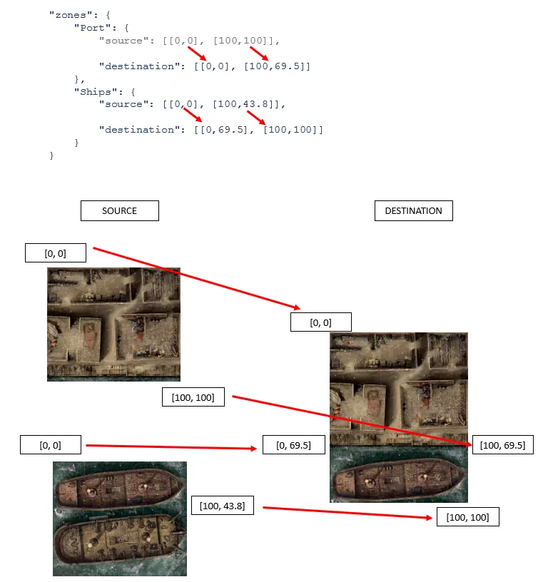

# How to add a new board to the Companion

* [Steps to add a new Board](#steps-to-add-a-new-board)
* [Technical different types of board](#technical-different-types-of-board)
    * [Classic board](#classic-board)
    * [Composition board](#composition-board)
    * [Part board](#part-board)
* [Technical references](#technical-references)
    * [Technical references: Classic and Part board details](#technical-references-classic-and-part-board-details)
    * [Technical references: Composition board](#technical-references-composition-board)

## Steps to add a new Board

To add a new board, here are the basic steps:
* Get an image of the board between about 900px and 1200px. Convert it to the webp format if you can.
* Use the maps tool to create the zones and their line of sight.
* Export the result.
* Manually edit the file to add all other informations.
* Merge the new map to the map.json file.
* Propose a pull request (PR) to integrate the new map to the application.

To do this you will need to read all the technical informations after and also this [Guide of the "maps" tool](Guide.md).

## Technical different types of board

The boards are stored in **Application/data/maps.json** and translations in **Application/data/maps/lang/maps.LANG.json**.
First of all, lets understand the different kind of boards existing in the companion.

### Classic board

A classic board visible in the Companion.

It is described by its image, rules, zones, line of sights...

A classic board is in the `list` part of the JSON file.

### Composition board

A board visible in the Companion but composed by existing (full or partial) other boards. 

For example, in Conan, the "Ship at Port" is composed by a part of the "Ships" board and the full "Port" board. 

It is described by its image, a mapping between the source maps and the target map, additional line of sights (created between source maps), potential merged zones.

A Composition board is in the `compositions` part of the JSON file.

### Part board

A part board is **NOT** visible in the Companion and its purpose is only to be composed in other boards.
Otherwise, it is the same as a classic board.

For example, in Conan, the deck of the Chebek is a part board that is not visible by itself, but is composed in the "Chekek" and "Chebek and Galley" boards.

A Composition board is in the `parts` part of the JSON file.

## Technical References

### Technical References: Classic and Part board details

#### `id` 

The unique board identifier (unique between all `list` `compositions` and `parts`.
Id made of letters, digits and "_".
Mandatory.

#### `description`

The description is an object composed of the following items:
* `version`: should always be "1.0"
* `origins`: an array of the expansions delivering this board. See data/expansion.json to see the possible values.
* `copyright`: all official maps should be valued with "Monolith".
* `rules`: this value will depend on the application. See the rules for the right application under.
* `thumbnail`: a relative path to the thumbnail image of the board. The thumbnail has to be 256px by 220px. The image should use the webp format.
* `board`: a relative path to the main image of the board. The image has to be around the 1000px by 1000px (depending on the board ratio). The image should use the webp format.
* `losFile`: Optionally, the board can provide a static image of the line of sights for users who prefer to download and print them. The image size should have the same constraints as the `board`.
* `pdf`: Optionally, the url to download the specific rules of the board. This items should be valued upon the language.
* `title`: The readable name of the board. This items should be valued upon the language.
* `totopic`: Optionally, an url to a topic discuting the board on The-Overlord forum. This items should be valued upon the language.

Example:

**data/maps.json**

```
"id": "Pict_Village",
"description": {
    "version": "1.0",
    "origins": ["corebox"],
    "copyright": "Monolith",
    "rules": [],
    "thumbnail": "data/maps/data/Pict_Village/thumb.webp",
    "board": "data/maps/data/Pict_Village/board.webp",
    "losFile": "data/maps/data/Pict_Village/los-v7.webp"
},
```

**data/maps/lang/maps.en.json**

```
"Pict_Village": {
    "description": {
        "title": "Pict village",
        "rules": [],
        "totopic": "https://the-overlord.net/index.php?/topic/27-core-pict-village/"
    }
},
```

#### `description/rules` for Conan

`rules` is an array of objets with the following properties:
* `coordinates`: Array of coordinates. Can be empty for non located rules. One coordinate is [x, y] where x is a percent of the width and y a percent of the height.
* `title`: The rule title. This items should be valued upon the language.
* `description`: The rule description. This items should be valued upon the language. The description can use image tags such as `{dice_yellow}`, `{dice_red_reroll}` or `gem_blue` for example.

Example of 2 rules. One with many locations and the other with none.
Note that order of the rules have to be consistent between all translations file and the main data file.

**data/maps.json**

```
rules": [
    {
        "coordinates": [[63, 23], [18, 52], [26, 57], [39, 83], [34, 43], [55, 54], [67, 76], [79, 57]]
    },
        "coordinates": []
    }
],
```

**data/maps/lang/maps.en.json**

```
"Pict_Village": {
    "description": {
        "rules": [
            {
                "title": "The hut flaps",
                "description": "A character must spend 1 extra movement point to move across a border into or out of a hut because of the hut flaps at the entrance of each hut (and inside the big one)."
            }, {
                "title": "Wooden Huts",
                "description": "A character with Wall Wrecker can use it to move across the wall of one of the wooden huts. The walls of an occupied hut (see page 22 of the Revised Heroes’ Book) cannot be wrecked using Wall Wrecker."
            }
        ]
    }
```

#### `description/rules` for Batman

Rules for Batman are divided in 2:
* An image
* Its legend

The tags are:
* `image` The path to a webp image. The image size should be above 1000px.
* `ratio` For rendering purposes the image ratio should be provider. For example `"ration": 1.33`.
* `legend` To describe which legend items should appear, depending on what is displayed on the image. All value are `true` by default, so you only have to specify the `false` values.
    * `boundaries` The type of boundaries to display.
        * `orange` The boundaries for normal move (orange)
        * `white` The boundaries for normal move (white)
        * `special` The boundaries that require a special move (red).
        * `wall` The wall boundaries (yellow / dashed)
        * `wall_level` The wall level boundaries with a climb value (yellow)
    * `special_moves` The special moves that appears on the board.
        * `jump` Displays the jump rule.
        * `climb` Dsplays the climb rule.
        * `fall` Display the fall rule.
        * `climb_fall` Display the climb/fall rule
    * `areas` An area of values to display in the areas legend. Empty by default.
        * `promontory` To display to rule about obstacles. Example: `"areas": ["promontory"]`
    * `elevation` An array of elevation levels to display on the map. Example: `"elevation": [0, 1, 2, 5, 6]`

Note: As there is no user text, there is no data that changes upon the user language.

#### `size`

The image width and height in pixels. Example 
```
"size": [1062, 1309]
```

#### `zones`

The `zones` tag is a list of zones with a unique identifier.
Zones identifiers can be anything, but the convention is a number starting at 1 for the top left zone, and continuing on the right, the continue on the next line and so on to the bottom right.

A zone describe an delimited area of the board, with center (generally one, but sometimes zero or two), lines of sights to other zone and a level of altitude. 
* `area` The succession of points coordinates to draw the perimeter of the zone. One coordinate is [x, y] where x is a percent of the board width and y of the board height. So x and y are both between 0.0 and 100.0 included.
    * Important, the perimeter is automatically closed so the last point is not the first point. For example, a square perimeter is thus defined by 4 points and not 5.
    * Example: `"area": [[0.37, 0.32], [13.97, 17.17], [18.11, 13.3], [21.23, 15.24], [46.05, 0.54]]`
    * It is important to use the same points as much as possible between neighbor zones sharing a border.
    * If the zone touch the edge of the board ensure to use 0.0 and 100.0 in coordinates (and not 0.3 or 99.75).
* `centers` Array of coordinates to locate the centers of the zone.
    * Example of area with no center `"centers": []`
    * Example of area with one center `"centers": [[22.33, 5.69]]`
    * Example of area with two centers `"centers": [[22.33, 5.69], [29.1, 5.69]]`
* `level` Is the altitude level of the zone in the map. 0 is the zone at the most bottom. Add 1 per high-level. Zones centers displays the level with concentric circles. Do not skip numbers even to represent a big altitude difference. Levels are used to display the yellow dice advantage.
* `links` Is an array of string. One string is 3 values separated by the # character
    * The first part is the number of the center of the current zone concerned by the line of sight. Most of the time, this value will be 1 (since most zones only have 1 center). It can be 0 if the line of sight does not link center of zones (because there is no center, or because of an orange border for example). It can be 2 to talk about the 2nd center and so on.
    * The second part is the name of the target zone.
    * The third one is the center number of the target zone. Can also be 0, 1, 2...
    * Example, `"links": ["1#2#1", "0#3#0", "2#4#1"]` will create line of sights between the current zone and zones 2, 3 and 4. 
        * Current zone (with its 1st center) will have a line of sight to Zone 2 (in its 1st center).
        * Current zone will have a line of sight to Zone 3. No centers are involved (orange border for example) so no line will be physically displayed
        * Current zone (with its 2nd center) will have a line of sight to Zone 4 (in its 1st center).

* `onewaylinks` Very rarely some zones have one way line of sights. For example, a forest zone where you can see without beeing seen. In this case, set `"onewaylinks": true` to avoid the system to launch an error whe detecting a missing "reverse" line of sight.

Example:

```
"zones": {
    "1": {
        "area": [[0.37, 0.32], [13.97, 17.17], [18.11, 13.3], [21.23, 15.24], [46.05, 0.54]],
        "centers": [[22.33, 5.69]],
        "links": ["1#4#1", "1#5#1", "1#7#1", "1#8#1", "1#15#1"],
        "level": 0
    },
    ...
]
```
TODO
Tool to create zones "easily"...

### Technical References: Composition board

#### `id` 

Same as a classic board.

#### `insertAfter` 

The identifier of a board in `list` to order the board.

#### `description`

Same as a classic board.
Rules are automatically computed, but additional rules can be added.

#### `size`

Same as a classic board.

#### `zones`

Here zones are not described but composed with other maps.

> If you need to compose a board with a non existing board: consider first creating a part for this non existing part, and then compose them.

The `zones` is a succession of zones identifier, and for each a `source` and `destination` mapping.

The source mapping is optional if the whole board is used.

The mapping is the target coordinates of the top-left and bottom-right corners.

A coordinate is a percent on x and a percent on y.

[0, 0] is top left.

[100, 0] is top right.

[0, 100] is bottom left.

[100, 100] is bottom right.

For example,


```
"zones": {
    "Port": {
        "destination": [[0,0], [100,69.5]]
    },
    "Ships": {
        "source": [[0,0], [100,43.8]],
        "destination": [[0,69.5], [100,100]]
    }
}
```

means that :

* The Port board will be used entirely (no "source" mapping equals [[0,0], [100,100]]).
* The Port board in the "Port at Ship" board will be in the final map at top-left [0,0] and until the middle of the right [100,69.5].
* The Ships board is cropped since with only take it from the top-left to the right in the middle if the height.
* The Shups board in the "Port at Ship" board will be located at the left, but in the middle of the height [0, 69.5] and until the bottom right [100, 100].



#### `reverseLinks`

A boolean to specify that the following `links` will be automatically read in both direction.

There is no need to define A -> B + B -> A: only one is enough.

#### `links`

This describe links between source boards.

These line of sights are describe as in classic boards except that zone names are prefixed with the board identifier.

For example, the zone "27" of the "Port" map will be referenced as "Port-27".

Example:

```
"Port-36": ["1#Ships-48#1"],
```

means that the zone "36" of the Port board has a line of sight on the zone "48" of the Ships board.

As in classic line of sights the prefix "1#" means to consider the first center of "Port-36", and the "#1" suffix means to consider the first center of the zone "48" of the Ships board.

#### `merge`

Optionally, some zones of several boards may be merged during the composition.

For example, in the "Ship at port", sea zones of the port are the same zone as the sea zones of the ship and thus needs to be merged.

Zones to be merges needs to be names, 2 by 2.

Example:

```
"merge": [
    ["Port-28", "Ships-1"],
    ["Port-30", "Ships-2"],
    ["Port-32", "Ships-3"],
    ["Port-34", "Ships-4"],
    ["Port-36", "Ships-5"]
]
```

means that the zone "28" of the Port board is the same as the zone "1" of the Ships board.